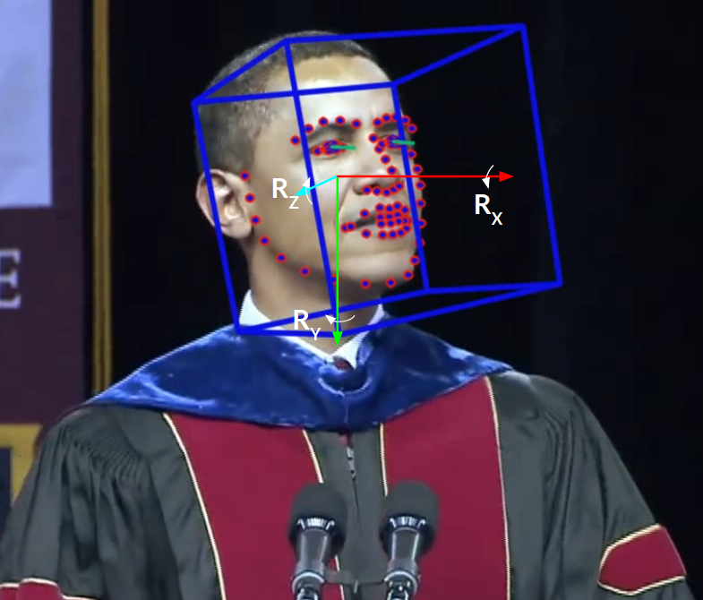

# Project 3: Facial Filters
## Basic Knowledge
### [Facial Landmarks Detection](https://www.pyimagesearch.com/2018/04/02/faster-facial-landmark-detector-with-dlib/) (Have a general knowledge)

<p align="center">
  
</p>


### Get to know Perspective Transformation
[Perspective Transformation Wiki](https://en.wikipedia.org/wiki/Transformation_matrix#Perspective_projection)

[An Example](https://www.pyimagesearch.com/2014/08/25/4-point-opencv-getperspective-transform-example/) for [getPerspective](https://docs.opencv.org/2.4/modules/imgproc/doc/geometric_transformations.html?highlight=warpaffine#getperspectivetransform/) (opencv Doc).
<p align="center"> 
  From
  
  To
  
</p>


## Instruction for adding facial filters
* Find a **Vector Image** as mask filter like below 
<p align="center">
  
  <div align="center">glasses</div>
</p>

* Detect **Face Landmarks** from an image

  Recommended face landmark detection library **[dlib](https://github.com/davisking/dlib)**, and open source Face Analysis Toolkit **[OpenFace](https://github.com/TadasBaltrusaitis/OpenFace)**
<p align="center">
  
  <div align=center>

  [image courtersy](http://blog.dlib.net/2018/01/correctly-mirroring-datasets.html)
  </div>
</p>

* Anchor Point

  Anchor point is the point of face landmarks that aligns with the center of your mask filter.

  Example:  
``
anchor_pt = [landmarks[27, 0], landmarks[27, 1]]
``

* The most important part is how to decide **Four pairs of "Perspective Points"** for sticking mask filter.

  **Note**: no more than **three** can be on the same line.

  Because size of the mask filter is (600 x 200), the original perspective points are:
  ```
  orgn_per_pts = [[0, 0], [599, 0], [299, 99], [299,199]]
  ```
  It can also be the four corners of the mask filter.

  Project the mask filter to the corresponding four points.
  ```
  # Decide Face Rotate angle
  face_left_extreme = [landmarks[0, 0], landmarks[0, 1]]
  face_right_extreme = [landmarks[16, 0], landmarks[16, 1]]
  x_dif = face_right_extreme[0] - face_left_extreme[0]
  y_dif = face_right_extreme[1] - face_left_extreme[1]
  face_roll_angle = math.atan2(y_dif, x_dif)

  per_tl = [landmarks[17, 0] + 10 * math.sin(face_roll_angle), 
            landmarks[17, 1] + 10 * math.cos(face_roll_angle)]
  per_tr = [landmarks[26, 0] + 10 * math.sin(face_roll_angle),
            landmarks[26, 1] + 10 * math.cos(face_roll_angle)]
  per_3 = anchor_pt
  per_4 = [anchor_pt[0] - 100 * math.sin(face_roll_angle),
           anchor_pt[1] - 100 * math.cos(face_roll_angle)]
  dest_per_pts = [per_tl, per_tr, per3, per_4]
  ```
  the major goal in this step is to give an accurate estimation of destination perspective points for projecting mask filter onto the face.
* Find Perspective Transformation
  ```
  M = cv2.getPerspectiveTransform(orgn_per_pts, dest_per_pts)
  ```

* Project mask filter
  ```
  p_mask = cv2.warpPerspective(mask_filter, M, (face_img.shape[1], face_img.shape[0]))
  ```

* Overlay the mask to face image
  ```
  def overlay(face_img, overlay_img)
  # Mask RGB info
  overlay_rgb = overlay_img[:, :, :3]
  # Opacity value
  overlay_mask = overlay_img[:, :, 3:]
  # Background
  bkgd_mask = 255 - overlay_mask
  overlay_mask = cv2.cvtColor(overlay_mask, cv2.COLOR_GRAY2BGR)
  bkgd_mask = cv2.cvtColor(bkgd_mask, cv2.COLOR_GRAY2BGR)

  other_part = (face_img * (1 / 255.0)) * (bkgd_mask * (1 / 255.0))
  overlay_part = (overlay_rgb * (1 / 255.0)) * (overlay_mask * (1 / 255.0))

  final_img  = cv2.addWeighted(other_part, 255.0, overlay_part, 255.0, 0.0)
  ```

## Further Goal: Refine Mask
We have previously recommended **[OpenFace](https://github.com/TadasBaltrusaitis/OpenFace)**, it provides estimation for head pose, which includes head's rotative movements: [raw pitch and yaw](https://www.researchgate.net/figure/Orientation-of-the-head-in-terms-of-pitch-roll-and-yaw-movements-describing-the-three_fig1_279291928). Estimations are provided in ***speech.csv*** file at each frame. Since relative pose between face and masks are assumed to be fixed, **roll** angle could replace the ``face_roll_angle`` calculated above. **pitch** angle can also help us determine four "perspective points" in the image so as to improve the mask filtering effect.
<p align="center">
  
</p>

Three axes are shown in the image above, counter-clockwise is the positive rotation direction for each axis. ``Rz`` is the axis which points backwards and also the axis head **rolls** along with, roll angles are given in ``pose_Rz`` column of the ***speech.csv***. As well as **pitch** value in ``pose_Rx`` colum and **yaw** in ``pose_Ry`` column.